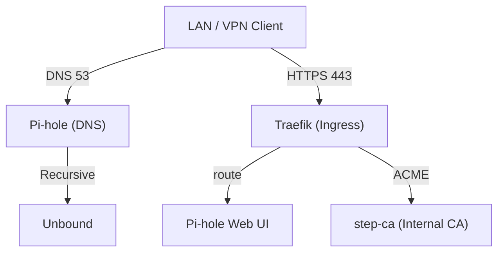
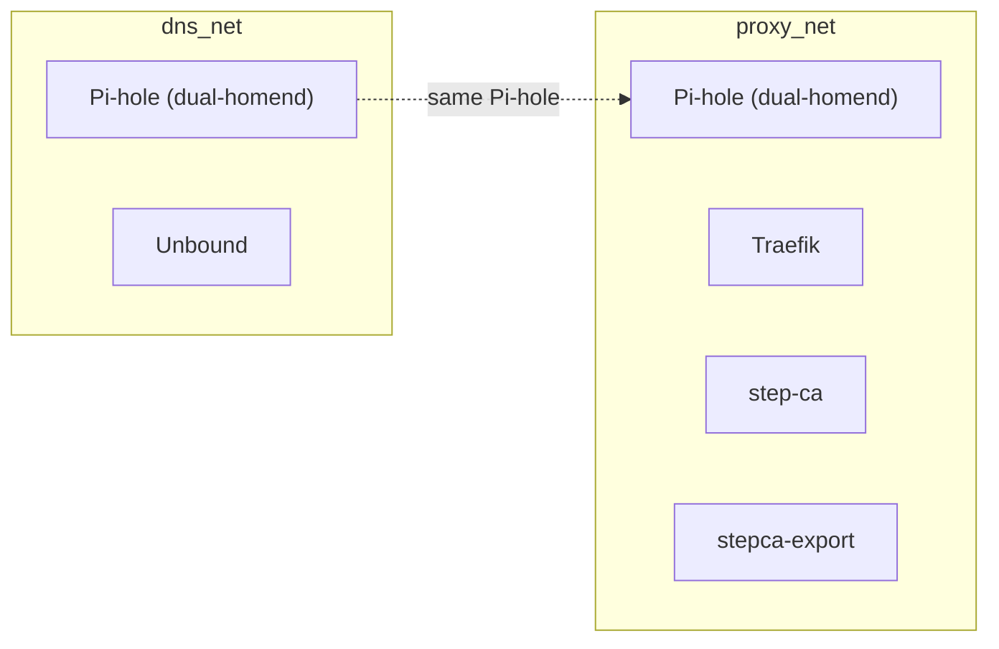

# Home Lab Infrastructure Stack
<!-- Project Status -->
[](https://github.com/Jannis510/home-server/actions/workflows/ci.yml)
[](https://github.com/Jannis510/home-server/actions/workflows/security.yml)
[](https://github.com/Jannis510/home-server/releases)
[](https://github.com/Jannis510/home-server/blob/main/LICENSE)

<!-- Stack -->
[](https://github.com/traefik/traefik)
[](https://github.com/pi-hole/pi-hole)
[](https://github.com/NLnetLabs/unbound)
[](https://github.com/smallstep/certificates)

Docker Compose-based infrastructure for a private home lab, designed for operation within a local network.
The stack provides internal DNS resolution, edge reverse proxy routing, and a private certificate authority
for services under the reserved domain `*.home.arpa`.

External access is intended exclusively via VPN; no direct public exposure is required.

---

## Table of Contents

* 📦 [Overview](#-overview)
* 🏗️ [Architecture](#-architecture)
* ⚙️ [Prerequisites](#-prerequisites)
* 🚀 [Quick Start](#-quick-start)
* 🔧 [Configuration](#-configuration)
* 🛠️ [Operations](#-operations)
* 🔐 [CI/CD and Security](#-cicd-and-security)
* 📖 [Documentation](#-documentation)
* 🔐 [Security Considerations](#-security-considerations)
* 🩺 [Troubleshooting](#-troubleshooting)
* 📄 [License](#-license)

---

## 📦 Overview

This repository provides a production-inspired infrastructure stack
for a private home lab operating within a LAN environment.

The stack consists of:
* **Pi-hole** – local DNS frontend
* **Unbound** – recursive upstream DNS resolver
* **Traefik** – reverse proxy and HTTPS entrypoint
* **Smallstep step-ca** – private certificate authority with ACME support

All services are published under the reserved domain `*.home.arpa` and are intended strictly for internal use.
Remote access is performed exclusively via VPN; no services are directly exposed to the public internet.

The stack emphasizes:

* Deterministic, containerized deployment
* Infrastructure-as-Code configuration
* Reproducible local environments
* Network segmentation and controlled service boundaries
* Integrated CI validation and security scanning

---

## 🏗️ Architecture

This section describes traffic flow, network boundaries, service exposure, and trust zones of the stack.




Clients inside the LAN or connected via VPN use Pi-hole as their primary DNS resolver.
External DNS queries are forwarded to Unbound, which performs recursive resolution.

All HTTPS traffic enters through Traefik, which acts as the single ingress point.
Traefik terminates TLS using certificates issued by the internal step-ca instance via ACME.

Backend services (e.g., the Pi-hole web interface) are never exposed directly and are reachable only through Traefik.

---

### Traffic Flow

1. DNS clients query **Pi-hole** (`53/tcp`, `53/udp`).
2. Pi-hole forwards external DNS lookups to **Unbound** (`5335/tcp`, internal only).
3. HTTP(S) traffic enters through **Traefik** (`80/tcp`, `443/tcp`).
4. Traefik requests TLS certificates from **step-ca** via ACME over the internal `proxy_net`.
5. Traefik routes requests to backend services (e.g., Pi-hole web UI on container port `80`).

---

### Open Host Ports

The Docker host exposes only the following ports:

* `53/tcp`, `53/udp` → `pihole` (DNS)
* `80/tcp`, `443/tcp` → `traefik` (HTTP/HTTPS ingress)

No other containers are directly published to the host network.

⚠ Note: By default, Docker publishes ports on all host interfaces (0.0.0.0).
If the host has multiple network interfaces (e.g., LAN, VPN, WAN),
ensure ports are either:

- Bound explicitly to the LAN IP, or
- Restricted via host firewall rules.

---

### Service Reachability

#### Public Internet
* No direct exposure by default.
* No port forwarding should be configured on the router.
* Ensure that host firewall rules block inbound WAN traffic.

#### LAN / VPN Clients
* DNS via host IP or `pihole.home.arpa` (`53/tcp`, `53/udp`)
* HTTPS ingress via:
  * `https://traefik.home.arpa`
  * `https://pihole.home.arpa`

#### Internal-Only Services
* `unbound` – reachable only within `dns_net`
* `stepca` – reachable only within `proxy_net`

ACME communication between Traefik and step-ca occurs exclusively inside the Docker network.

---

### Access Control Model

* **LAN clients** – permitted DNS and HTTPS ingress access.
* **VPN clients** – same access policy as LAN clients.
* **Public internet** – no direct access permitted.
* **Administrative access**
  * Traefik dashboard protected by BasicAuth.
  * Pi-hole admin available at `/admin/` via HTTPS behind Traefik.

---

### Docker Network Segmentation



* `dns_net`
  * Services: `pihole`, `unbound`
  * Purpose: resolver chain isolation

* `proxy_net`
  * Services: `traefik`, `stepca`, `pihole`, `stepca-export`
  * Purpose: HTTPS ingress and internal PKI

`pihole` is dual-homed (`dns_net` + `proxy_net`) and acts as a controlled bridge between DNS resolution and web ingress naming under `*.home.arpa`.

---

### Trust Zones

1. **client_zone**
   * LAN and VPN clients
   * Trusted internal consumers

2. **dns_net**
   * Resolver path
   * Isolated DNS processing

3. **proxy_net**
   * HTTPS ingress
   * ACME certificate issuance
   * PKI boundary

Clear separation of trust zones minimizes lateral movement and reduces cross-service exposure.

---

### Design Rationale

The architecture follows production-inspired design principles:

* Explicit port exposure (minimal surface area)
* Network segmentation using dedicated Docker networks
* Reverse proxy as the single HTTPS entrypoint
* Internal PKI instead of self-signed ad-hoc certificates
* No public-facing services

Only required services are dual-homed.  
No container is directly exposed except through defined ingress paths (DNS and HTTPS).


---

## ⚙️ Prerequisites

The following requirements must be met before deploying the stack.

---

### Host Requirements

* Linux-based host system (Debian/Ubuntu recommended)
* Docker Engine (24.x or newer recommended)
* Docker Compose v2 (plugin-based)
* Access to the Docker socket (required by Traefik for dynamic service discovery)

---

### Reference Platform

The stack was primarily developed and tested on:

* Raspberry Pi 5
* 8 GB RAM
* SSD-based storage (recommended)

The architecture is not hardware-bound and is expected to run on any Linux host with sufficient CPU, memory, and Docker support.

---

### Network Assumptions

* The host has a static IP address within the LAN.
* LAN clients are configured to use the host as their primary DNS server.
* The reserved domain `home.arpa` is managed internally via Pi-hole.
* No public port forwarding is configured on the router.

---

### Access Model Assumptions

* The stack operates within a private LAN environment.
* Remote access is provided exclusively through a VPN tunnel.
* No services are intended for direct public internet exposure.

---

## 🚀 Quick Start

The following steps initialize and start the infrastructure stack.

---

### 1. Prepare the environment file

Copy the template:

```bash
cp .env.example .env
```

Adjust at minimum:

* `PIHOLE_LOCAL_IP`
* `PIHOLE_WEBPASSWORD`
* Optional: timezone and StepCA defaults

Ensure the configured IP matches the static LAN address of the host.

---

### 2. Create Traefik BasicAuth credentials

Generate a bcrypt htpasswd entry:
```bash
docker run --rm httpd:2.4-alpine htpasswd -nbB admin <YOUR-PASSWORD-HERE>
```

Write the generated line to:

```text
config/traefik/usersfile
```
This protects the Traefik admin dashboard from unauthenticated access.

---

### 3. Create step-ca password file

Generate a strong random password:

```bash
docker run --rm alpine:3.20 sh -lc "apk add --no-cache openssl >/dev/null && openssl rand -base64 32 | tr -d '\n'; echo"
```

Store the generated value in:

```text
config/stepca/password.txt
```
This password protects the internal certificate authority.

---

### 4. Start the stack

```bash
docker compose up -d
```

During the initial startup:
- All services are launched.
- The stepca-export one-shot task runs automatically.
- Root CA artifacts are generated under: `artifacts/pki/`

The export task does not remain running after completion.

---

### 5. Configure Router DNS (Required for LAN Clients) and verify core services

To ensure that all LAN devices use Pi-hole for DNS resolution, configure your router’s DHCP settings:

1. Open your router’s administration interface.
2. Navigate to **DHCP / LAN settings**.
3. Set the **Primary DNS server** to the static IP of the home server  
   (value of `PIHOLE_LOCAL_IP`).
4. Remove any external DNS servers (e.g., ISP DNS, `8.8.8.8`).
5. Save the configuration and restart DHCP, or reconnect client devices.

After renewing the DHCP lease, clients should display:

```text
DNS Server = <PIHOLE_LOCAL_IP>
```

Verify core services from a LAN or VPN client:
* Traefik dashboard: `https://traefik.home.arpa`
* Pi-hole admin: `https://pihole.home.arpa`

Ensure that:
- DNS resolution works via the host IP.
- HTTPS certificates are issued by the internal CA.

---

### 6. Trust the internal Root CA on client devices (recommended)

To avoid TLS warnings, install the exported Root CA certificate on all trusted LAN/VPN client devices.

Root CA location (generated during initial startup):

* `artifacts/pki/root_ca.crt`

#### Option A: Import into the OS trust store (recommended)

Import `root_ca.crt` into the system certificate store of each client device you trust.

Notes:
* Treat the Root CA as a sensitive trust anchor.
* Install it only on devices you control.
* Do **not** distribute it to untrusted or shared devices.

#### Option B: Browser-only trust (quick workaround)

If you do not want system-wide trust, you can import the Root CA into the browser certificate store (varies by browser/OS).

After installation, verify that the following endpoints are trusted without certificate warnings:

* `https://traefik.home.arpa`
* `https://pihole.home.arpa/admin/`

---

## 🔧 Configuration

Configuration is environment-driven and fully version-controlled.  
The stack is configured through a small set of files with clear ownership.

---

### Configuration Entry Points

| File | Purpose |
|------|---------|
| `compose.yml` | Service orchestration, networks, volumes, port exposure |
| `.env` (from `.env.example`) | Runtime settings (IP, passwords, domain-related values, time zone) |
| `config/unbound/unbound.conf` | Recursive resolver behavior, privacy and hardening options |
| `config/traefik/traefik.yml` | Static Traefik configuration (entrypoints, providers, logging) |
| `config/traefik/usersfile` | BasicAuth credentials for the Traefik dashboard |
| `config/stepca/*` | step-ca configuration and secrets (password file, CA settings) |
| `config/stepca/export-roots.sh` | Root CA export helper (generates `artifacts/pki/*`) |

---

### Minimal Required Settings

In `.env`, ensure at minimum:

* `PIHOLE_LOCAL_IP` – static LAN IP of the host (DNS endpoint)
* `PIHOLE_WEBPASSWORD` – Pi-hole admin password

Recommended:

* `TZ` – consistent timestamps across services (logs, certificates)
* step-ca defaults (if you want to customize CA name, validity, etc.)

---

### Certificates and Trust

Root CA artifacts are written to:

* `artifacts/pki/root_ca.crt`
* `artifacts/pki/roots.pem`

Install `root_ca.crt` into the trust store of trusted client devices to avoid TLS warnings.

---

### DNS and Naming

All internal services are published under `*.home.arpa`.  
Ensure LAN/VPN clients use Pi-hole as their DNS server so the names resolve consistently.


---

## 🛠️ Operations

Operational and maintenance commands for the stack (including volumes and reset procedures).

---

### Start / Update (Standard)

```bash
docker compose up -d
```

Starts all services or applies changes to `compose.yml` and related configurations. Containers are recreated if required.

---

### Stop (Remove Containers, Keep Data)

```bash
docker compose down
```

Stops the stack and removes containers and networks while keeping volumes intact (persistent data remains available).

---

### Status

```bash
docker compose ps
```

Displays the current status of all services.

---

### Logs

All services:

```bash
docker compose logs -f
```

Single service (example):

```bash
docker compose logs -f traefik
```

---

### Restart a Single Service

```bash
docker compose restart <service>
```


---

## Volumes & Data Persistence

Docker volumes store persistent state (e.g., Pi-hole, Unbound, step-ca configuration and keys).

As long as volumes exist, settings, cryptographic material, and runtime state survive container restarts.

### List Volumes

```bash
docker compose config --volumes
docker volume ls
```

---

## Reset / Reinitialization

### Soft Reset (Recreate Containers, Keep Data)

```bash
docker compose down
docker compose up -d
```

Reuses existing volumes → CA remains unchanged, Pi-hole data persists, etc.

---

### Hard Reset ( ⚠ Data Loss)

```bash
docker compose down -v
```

Removes containers **and** volumes. On the next startup, all services are initialized from scratch.

---

## Important: PKI / step-ca

If volumes are removed, `step-ca` will generate a new Certificate Authority (CA).

Consequences:

- Previously issued certificates become untrusted
- All clients must reinstall the newly generated Root CA
- Any previously trusted trust chain is invalidated

Plan CA resets carefully.

---

## Regenerating PKI Export Artifacts

If `stepca-export` writes Root CA artifacts to `artifacts/pki/`, previously exported files may prevent regeneration (for example, if scripts do not overwrite existing files).

After performing `docker compose down -v`, it is recommended to:

1. Remove old export artifacts

```bash
rm -rf artifacts/pki/*
```

2. Re-run the export job

```bash
docker compose run --rm stepca-export
```

Fresh artifacts will then be available at:

```
artifacts/pki/roots.pem
artifacts/pki/root_ca.crt
```

---

## Cleanup (Optional)

### Remove Unused Images and Cache

```bash
docker system prune
```

Removes unused resources (containers, networks, dangling images). Volumes are not removed unless explicitly specified.

---

### Remove Unused Resources Including Volumes (Highly Destructive)

```bash
docker system prune --volumes
```

Only use this if you are certain that no important volumes are required anymore.

---

## 🔐 CI/CD and Security

This repository uses GitHub Actions to validate changes and enforce baseline security controls.
The goal is to prevent broken Compose configurations, catch common scripting issues early, and continuously scan for known vulnerabilities.


Workflow details and maintenance notes: [`docs/github-workflows.md`](docs/github-workflows.md)

---

### CI Pipeline

The CI workflow performs:

* **Docker Compose validation** (syntax + configuration consistency)
* **YAML linting** (formatting and common errors)
* **ShellCheck** for scripts (static analysis)
* **Policy checks**
  * no floating image tags (e.g., `:latest`)
  * basic repository hygiene checks

In addition, lightweight **smoke tests** verify:

* DNS resolution path (Pi-hole → Unbound)
* step-ca health/readiness
* Traefik routing behavior

CI failures are treated as blocking for merging changes that affect stack correctness.

---

### Security Scanning 

The security workflow runs **Trivy** scans for:

* **Repository filesystem** (misconfigurations, secrets, vulnerable dependencies)
* **Container images** referenced by the stack (known CVEs)

Findings should be triaged and addressed by:
* updating image versions
* adjusting configuration
* documenting accepted risk where appropriate

---

## 📖 Documentation

Additional documentation is located under the `docs/` directory.

* GitHub workflow details: [`docs/github-workflows.md`](docs/github-workflows.md)

Future extensions:

* Architecture deep-dive
* Backup and recovery procedures
* Operational runbooks

---

## 🔐 Security Considerations

This stack follows a minimal-exposure, LAN-only security model with explicit trust boundaries and controlled ingress.

---

### 1. Exposure Surface

By design, the Docker host is intended to expose only:

* `53/tcp`, `53/udp` → DNS (Pi-hole)
* `80/tcp`, `443/tcp` → HTTPS ingress (Traefik)

No other containers should be published to the host network.

All administrative interfaces are accessible only through HTTPS behind Traefik.

This assumes:

- No router port forwarding is configured
- Host firewall rules block unsolicited WAN traffic
- Ports are not rebound to public interfaces
---

### 2. Docker Socket Access

Traefik requires access to the Docker socket for dynamic service discovery.

⚠ Security Implication:

Access to `/var/run/docker.sock` is effectively equivalent to root-level control over the Docker host.

If Traefik were compromised, an attacker could:

- Inspect all container metadata
- Start new containers
- Mount host paths
- Escalate privileges
- Potentially gain full control over the host system

Mitigation strategies:

- Protect the Traefik dashboard via strong authentication
- Restrict host-level access to trusted administrators only
- Avoid overly permissive container labels
- Consider a Docker socket proxy (e.g., Tecnativa/docker-socket-proxy) in higher-security environments
- Restrict port bindings to LAN interfaces where possible
---

### 3. Internal PKI and Trust

TLS certificates are issued by an internal step-ca instance via ACME.

Advantages:

* No browser warnings from self-signed certificates
* Full control over the trust chain
* Independence from public certificate authorities

Important:

* Treat `config/stepca/password.txt` and CA materials as sensitive secrets.
* Distribute the Root CA only to trusted devices.
* Protect CA backups appropriately.

---

### 4. Network Segmentation

Services are separated into dedicated Docker networks:

* `dns_net` – resolver path
* `proxy_net` – ingress and internal PKI

Only required services are dual-homed.
Cross-network exposure is minimized by design.

---

### 5. Threat Model

This stack assumes:

* Trusted LAN and VPN clients
* No hostile internal actors
* No direct internet exposure

It is not designed as a hardened, internet-facing production environment.


### 6. Secret Handling

The following files contain sensitive information and must never be committed to version control:

- `config/traefik/usersfile`
- `config/stepca/password.txt`
- `.env`
- Any private keys under `config/stepca/`

Ensure:

- These paths are covered by `.gitignore`
- Only example/template files are tracked (e.g., `.example` variants)
- Backups of CA material are stored securely and offline

Note: Compromise of step-ca private keys requires complete CA rotation and client trust reinstallation.

## 🩺 Troubleshooting

Common issues and diagnostic steps.

---

### Traefik Dashboard Login Fails

**Symptoms**

* `401 Unauthorized`
* Browser repeatedly prompts for credentials

**Diagnostics**

* Confirm `config/traefik/usersfile` exists
* Ensure credentials are in bcrypt format (generate with `htpasswd -nbB`)

After updating credentials:

```bash
docker compose restart traefik
```

---

### DNS Records Not Resolving

**Symptoms**

* `*.home.arpa` does not resolve
* Services are unreachable in the browser

**Diagnostics**

Verify Pi-hole is running:

```bash
docker compose ps
```

Test name resolution from a client:

```bash
nslookup pihole.home.arpa <HOST_IP>
```

Confirm the following:

* `PIHOLE_LOCAL_IP` in `.env` matches the host's LAN IP
* Client devices use the Pi-hole host as their DNS server
* No competing DNS server is configured (e.g., router override or DHCP misconfiguration)

---

### HTTPS Certificate Warnings

**Symptoms**

* Browser reports an untrusted certificate

**Diagnostics**

* Confirm the Root CA is installed on the client device
* Ensure the correct CA file (`root_ca.crt`) was distributed
* Verify in the browser that the certificate issuer matches the internal `step-ca`

If volumes were reset:

* A new CA may have been generated
* Reinstall the newly generated Root CA on all client devices

---

### Port 53 Already in Use (Linux Hosts)

**Symptoms**

* Docker fails to start Pi-hole
* Error: "address already in use"

**Cause**

On Debian/Ubuntu systems, `systemd-resolved` may bind to port 53 by default.

**Resolution**

Check:

```bash
sudo lsof -i :53
```
If systemd-resolved is active, either:
- Disable it, or
- Reconfigure it to not bind on 0.0.0.0

## 📄 License

See [`LICENSE`](LICENSE).
